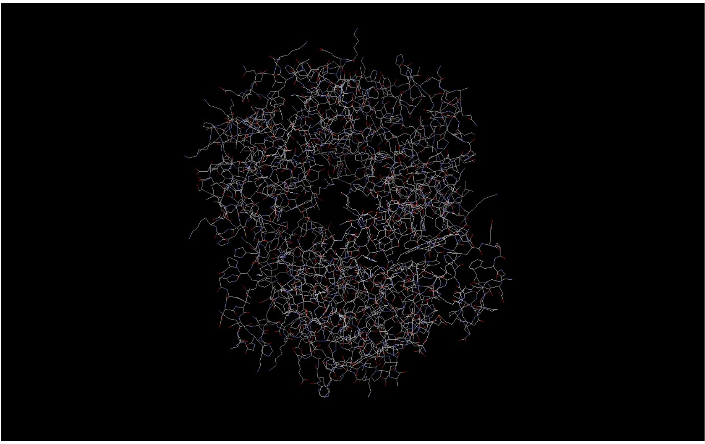
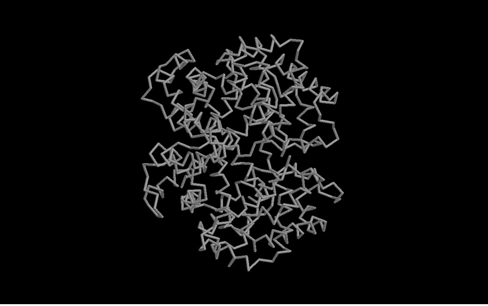
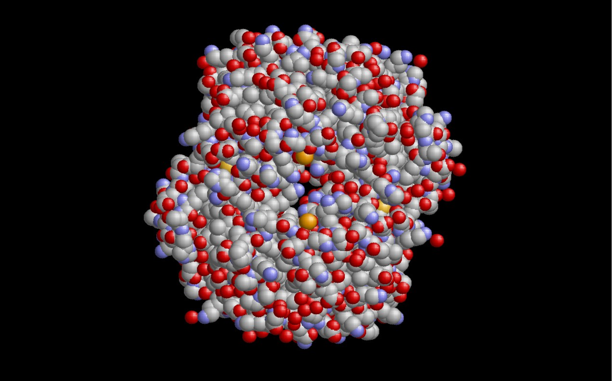
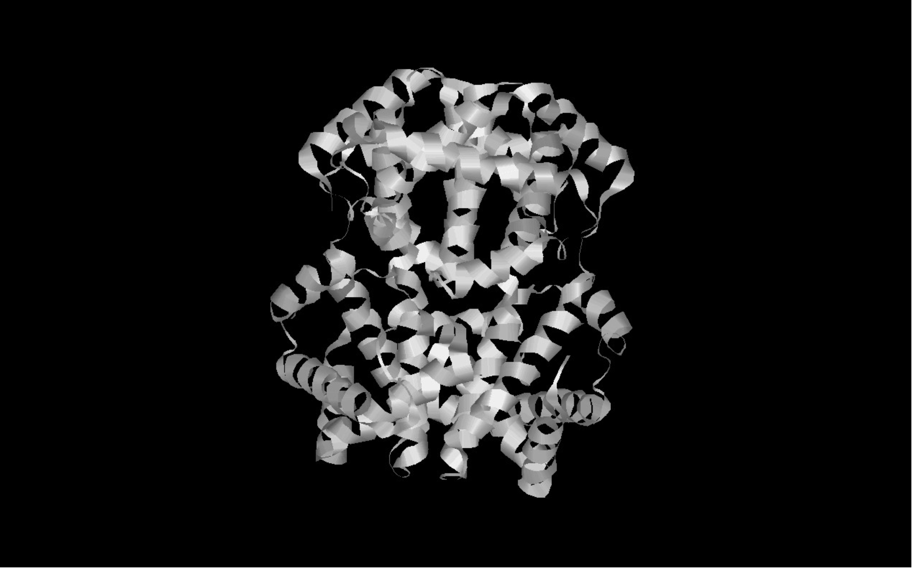
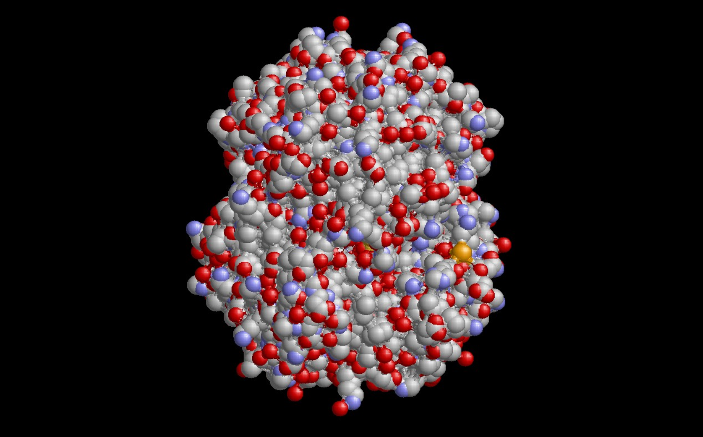
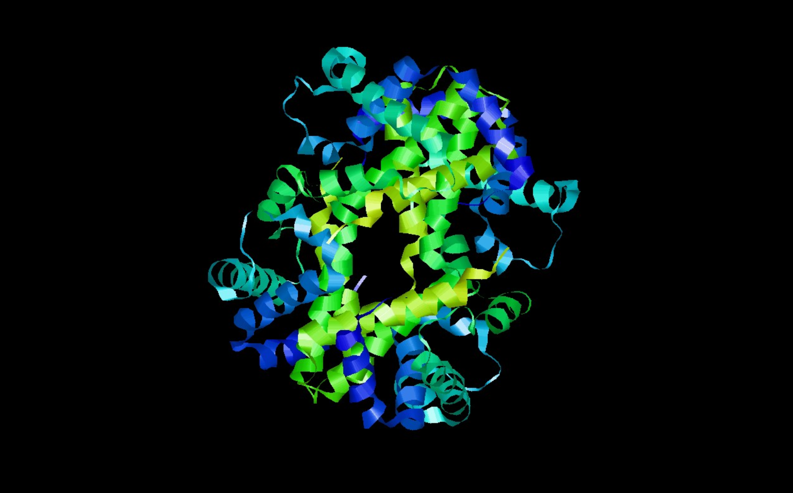

# Домашнее задание 4 — Визуализация белка в RasMol

- **ПО**: RasMol (`http://www.rasmol.org/`)
- **Структура белка**: Дезоксигемоглобин человека, PDB ID: 2HHB — ссылка на запись в RCSB PDB: `https://www.rcsb.org/structure/2HHB`
- **Файлы визуализаций**: см. изображения в `Task4/figures/`

## 1) Загрузка структуры
Короткий сценарий работы в RasMol (меню или командная строка RasMol):

```text
# Открыть файл (через меню: File → Open...)
load 2HHB.pdb
# Сброс ориентации при необходимости
reset
```

## 2) Типы визуализаций
Ниже приведены команды RasMol и ссылки на полученные изображения из папки `figures`.

### a) Wireframe (каркас)
```text
wireframe 100
spacefill off
ribbons off
backbone off
select all; color cpk
```
Изображение: 

### b) Backbone (осевой скелет)
```text
wireframe off
backbone 100
ribbons off
spacefill off
select all; color cpk
```
Изображение: 

### c) Spacefill (шаро‑палочная/spacefill)
```text
wireframe off
backbone off
ribbons off
spacefill 100
select all; color cpk
```
Изображение: 

### d) Ribbons (ленточная)
```text
wireframe off
backbone off
spacefill off
ribbons on
select all; color structure
```
Изображение: 

### e) Molecular surface (молекулярная поверхность)
```text
wireframe off
backbone off
ribbons off
spacefill off
# Построение и показ поверхности
surface on
# Вариант заливки/цветовой схемы
select all; color cpk
```
Изображение: 

## 3) Раскраска структуры
- **CPK**: `select all; color cpk` — применено для большинства визуализаций сверху.
- **По доменам/цепям** (пример для гемоглобина: цепи A, B, C, D):
```text
color group
```
Изображение: 

## 4) Пошаговое получение визуализаций
1. File → Open… → выбрать `2HHB.pdb` (из `Task4/`).
2. Выбрать нужный тип представления через Display/Render или через командное окно (см. команды выше).
3. Применить раскраску CPK или по доменам (цепям) командой `color`.
4. Отмасштабировать и повернуть модель мышью; при необходимости `reset`.
5. Экспорт изображения: File → Export → выбрать формат (`.png`) и сохранить в `Task4/figures/`.

## 5) Публикационное изображение
В качестве изображения публикационного качества выбран вариант с ленточной визуализацией, так как он информативно показывает вторичную структуру и доменную организацию гемоглобина:

- Рекомендуемое изображение: 
- Настройки: `ribbons on`, `color structure` (или индивидуальная раскраска по цепям), отключены лишние элементы, подобрана удобная ориентация и масштаб.

