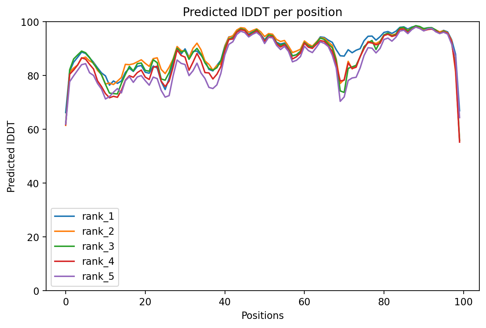
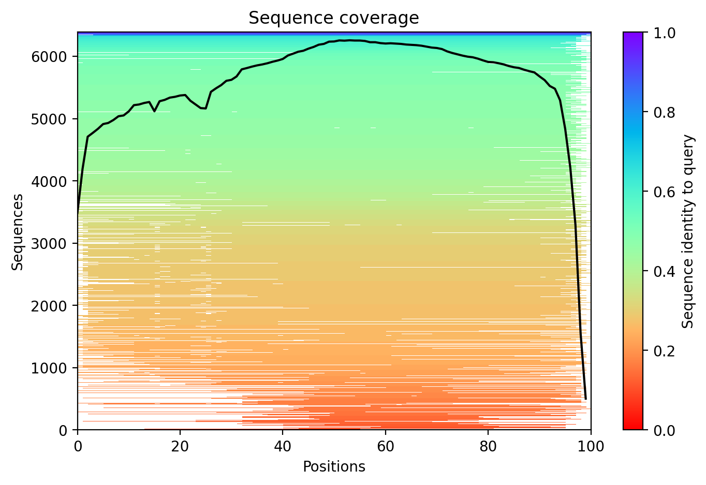

# Домашнее задание 5

## 1. Исходные данные
- **Название последовательности:** `first_sequence`
- **FASTA:** `Task5/first.fasta`
- **Аминокислотная последовательность:**  
  `MDADVISFEASRGDLVVLDAIHDARFETEAGPGVYDIHSPRIPSEKEIEDRIYEILDKIDVKKVWINPDCGLKTRGNDETWPSLEHLVAAAKAVRARLDK`

## 2. Использованные инструменты
- **Предсказатель 1:** ESMFold (Google Colab, копия ноутбука `Task5/predictions/ESMFold/ESMFold.ipynb`)
- **Предсказатель 2:** AlphaFold2 (ColabFold; результаты в `Task5/predictions/AlphaFold2/`)
- **Инструмент парного выравнивания:** CLICK 
- **Инструмент визуализации:** PyMOL *(запланировано для этапа визуализации)*

## 3. Предсказания третичной структуры

### 3.1 ESMFold
- **Ноутбук:** `Task5/predictions/ESMFold/ESMFold.ipynb`
- **Предсказанная структура:** `Task5/predictions/ESMFold/ptm0.790_r3_default.pdb`
- **PAE-матрица:** `Task5/predictions/ESMFold/ptm0.790_r3_default.pae.txt`
- **Лог выполнения:** `Task5/predictions/ESMFold/logs.txt`
- **Скриншот интерфейса:**  
  

### 3.2 AlphaFold2 (ColabFold)
- **Конфигурация запуска:** `Task5/predictions/AlphaFold2/config.json`
- **Ноутбук:** *(необходимо добавить скачанный `.ipynb` после выполнения)*
- **Предсказанные структуры (пять ранжированных моделей):**
  - `Task5/predictions/AlphaFold2/task5_73f88_unrelaxed_rank_001_alphafold2_model_3_seed_000.pdb`
  - `Task5/predictions/AlphaFold2/task5_73f88_unrelaxed_rank_002_alphafold2_model_1_seed_000.pdb`
  - `Task5/predictions/AlphaFold2/task5_73f88_unrelaxed_rank_003_alphafold2_model_5_seed_000.pdb`
  - `Task5/predictions/AlphaFold2/task5_73f88_unrelaxed_rank_004_alphafold2_model_2_seed_000.pdb`
  - `Task5/predictions/AlphaFold2/task5_73f88_unrelaxed_rank_005_alphafold2_model_4_seed_000.pdb`
- **Сопутствующие файлы:**
  - MSA: `Task5/predictions/AlphaFold2/task5_73f88.a3m`
  - Таблица метрик: `Task5/predictions/AlphaFold2/task5_73f88.csv`
  - Графики pLDDT и покрытия:  
      
    
- **Логи:** `Task5/predictions/AlphaFold2/log.txt`, `Task5/predictions/AlphaFold2/logs.txt`
- **Скриншот запуска:**  
  

## 4. Парное выравнивание структур (CLICK)
- **Входные файлы:** 
  - `Task5/predictions/ESMFold/ptm0.790_r3_default.pdb`
  - `Task5/predictions/AlphaFold2/task5_73f88_unrelaxed_rank_001_alphafold2_model_3_seed_000.pdb`
- **Полученные результаты:** расположены в `Task5/pairing/`
  - `17627122561446428A-17627122561446428B.1.pir` — выравнивание в формате PIR (цепь A обеих моделей; 100 остатков, 2 вставки/пробела)
  - Скриншоты интерфейса CLICK с параметрами запуска и суммарной статистикой:
    - 
    - 

## 5. Визуализация и окраска цепей
- **Инструмент:** RCSB PDB Mol\* 3D View [[ссылка]](https://www.rcsb.org/3d-view/)
- **Действия:** загружены результаты выравнивания (PDB из CLICK), активирована опция выравнивания двух моделей, каждой цепи присвоены контрастные цвета (ESMFold — красный, AlphaFold2 — синий), выполнена анимация поворота для оценки наложения.
- **Материалы в репозитории:** `Task5/vizualization/`
  -  — статичное представление раскрашенного наложения.
  - [Видео вращения суперпозиции](vizualization/TASK5_73F88_UNRELAXED_RANK_001_ALPHAFOLD2_MODEL_3_SEED_000-PTM0.790_R3_DEFAULT.1.PDB-PTM0.790_R3_DEFAULT-TASK5_73F88_UNRELAXED_RANK_001_ALPHAFOLD2_MODEL_3_SEED_000.1.PDB_camera-rock.mp4) — вращение с подчеркнутым цветовым разделением цепей.

## 6. Снимки экрана и медиа
- Снимки интерфейса предсказателей (ESMFold, AlphaFold2) включены в разделе 3.
- Снимки результатов CLICK находятся в `Task5/pairing/` (см. раздел 4).
- Визуализация наложения в Mol\* (RCSB 3D View) — файл скриншота и видео доступны в `Task5/vizualization/`.

## 7. Выводы о совпадении предсказаний
- Выравнивание CLICK показывает почти полное совпадение последовательностей (100 остатков, две короткие вставки), серьёзных смещений не наблюдается.
- В Mol\* (RCSB 3D View) окрашенные модели накладываются с минимальными отклонениями: основные элементы вторичной структуры совпадают, небольшие расхождения видны в гибких петлях.